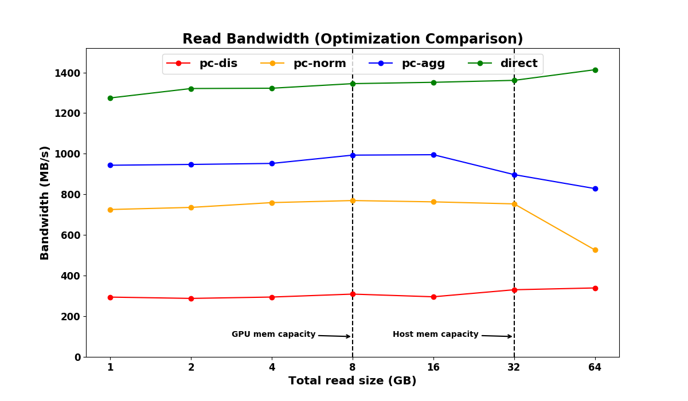

# DRAGON-DIRECT

DRAGON-DIRECT is an experimental feature. It allows data to be DMA'd between
NVMe and GPU devices without staging through host memory. Similar to DRAGON,
only our custom nvidia-uvm driver is needed. No other special drivers nor
modification to linux kernel is required.

## How it works

### Overview

[GPUDirect RDMA](https://docs.nvidia.com/cuda/gpudirect-rdma/) is an NVIDIA
technology that enables DMA between NVIDIA GPUs and third-party devices. It
works by mapping the specified GPU memory to the GPU PCIe BAR1 register. Other
PCIe endpoints can then access (i.e. DMA) that GPU memory portion via BAR1. It
works with pinned GPU memory, the memory that is allocated by cudaMalloc in
particular, and has never supported CUDA managed memory (from
cudaMallocManaged).

DRAGON, on the other hand, relies heavily on CUDA managed memory especially for
the GPU page-faulting feature. To solve this problem, we use pinned GPU memory
for staging. Hence, the data transfer becomes NVMe <-> GPU pinned memory <-> GPU
managed memory.

### Leveraging the PCI P2PDMA feature

Since linux kernel version 4.20, [PCI Peer 2 Peer DMA
support](https://elixir.bootlin.com/linux/v5.4.28/source/drivers/pci/p2pdma.c)
has been introduced. A device driver can register its PFN and get ZONE\_DEVICE
pages. VFS layer relies heavily on struct page but also works well with
ZONE\_DEVICE pages. Eventually, these pages are passed to the driver of the
device that backs the file. [nvme
driver](https://elixir.bootlin.com/linux/v5.4.28/source/drivers/nvme/host/pci.c#L826)
is aware of the ZONE\_DEVICE page type and correctly resolve the dma-able
address before doing data transfer. 

As the underlying technologies are ready, we use them to achieve the goal. First
we map GPU pinned memory to BAR1 then obtain the corresponding PFN of that BAR1.
Then we register this PFN with P2PDMA and get the ZONE\_DEVICE pages. For NVMe
<-> GPU pinned memory, we pass
[bio\_vec](https://elixir.bootlin.com/linux/v5.4.28/source/include/linux/bvec.h#L18)
to the VFS layer. VFS then takes care of the rest.

GPU pinned memory <-> GPU managed memory is done using the GPU CE (copy engine)
memcopy operation accessible from nvidia-uvm driver. More technical details can
be found in the code.

### Support on GeForce-class GPUs

Full features of GPUDirect RDMA requires Tesla- or Quadro-class GPUs. As we want
to use GPU pinned memory for staging and never for directly access from the
userspace CUDA, there is a way to add support to GeForce-class GPUs.

RM memory is an internal GPU pinned memory used for CPU-GPU communication inside
the driver. We can allocate RM memory on GPU and ask the main nvidia driver for
a CPU-accessible pointer, which is commonly used inside nvidia-uvm driver. The
underlying PFN, obtained via reverse mapping, that backs that pointer is always
within the GPU BAR1 range. Although there is no official documentataion, we
guess that that CPU-accessible pointer is mapped through BAR1, similar to how
[GDRCopy](https://github.com/NVIDIA/gdrcopy) works.

## Installation

Installation is the same as how you install DRAGON (see
[INSTALL.md](../INSTALL.md)). However, there are more steps you need to
make sure before using this feature.

1. Your linux kernel supports the P2PDMA feature. We have tested with Linux
kernel version 5.4.28 on Ubutun18.04 only.

2. P2PDMA feature is enabled. Check `/boot/config-$(uname -r)` for
`CONFIG_PCI_P2PDMA=y`.

3. IOMMU is disabled.

4. ACS is disabled.

5. Your NVMe device and GPU are connected via a PCIe switch (can be multiple
layer). You can connect them to PCIe host bridge but you need a supported CPU.
See https://elixir.bootlin.com/linux/v5.4.28/source/drivers/pci/p2pdma.c#L276.

6. Only
[nvidia-uvm-440.33.01-linux-kernel-5.4.28.patch](../drivers/nvidia-uvm-440.33.01-linux-kernel-5.4.28.patch)
has this feature implemented.

## How to use this feature

We add one more flag called *D_F_DIRECT*. Look at
[read-direct.cu](../tests/sanity-basic/read-direct.cu) for example code.

*DRAGON_DIRECT_NUM_GROUPS* environment variable has been included. This variable
control the behavior of DRAGON-DIRECT.

- `DRAGON_DIRECT_NUM_GROUPS=0`: Disable DRAGON-DIRECT. No GPUDirect-related
  buffers will be allocated. However, *D_F_DIRECT* will always failed.

- `DRAGON_DIRECT_NUM_GROUPS=1`: Enable DRAGON-DIRECT. GPUDirect readahead is
  disabled.

- `DRAGON_DIRECT_NUM_GROUPS=<i>` (i > 1): Enable DRAGON-DIRECT and GPUDirect
  readahead. More buffer on GPU memory and BAR1 will be allocated. The
  additional size is i * 2MB. If GPU does not have enough memory or BAR1, the
  entire DRAGON-DIRECT will be turn off. Use *dmesg* to see the status.

## Current limitations

1. *D_F_DIRECT* works with *D_F_READ* and *D_F_WRITE* only. We plan to add
support for other combinations of flags later.

2. Your file needs to be on that NVMe device. It may lead to kernel panic if you
put the file elsewhere. Currently, there is no checking for the location of your
file.

## Benchmarks

### System

- **Motherboard:** MSI MPG Z390 GAMING EDGE AC ATX LGA1151
- **CPU:** i5-9600K @ 3.70 GHz
- **GPU:** GeForce RTX-2070
- **RAM:** DDR4-2666 32GB
- **Storage:** Crucial P1 1 TB M.2-2280 NVME SSD
- **CUDA:** 10.2
- **NVIDIA driver:** 440.33.01
- **Linux kernel:** 5.4.28

*Note:* No PCIe switch. All components are connected via the host bridge.

### Read bandwidth

- **Application:** [read-bw.cu](../benchmarks/read-bw/read-bw.cu)
- Compared the read bandwidth when using different data transfer optimizations
  in DRAGON.
  - **pc-agg:** Using host staging via page-cache with aggressive readahead.
  - **pc-norm:** Using host staging via page-cache with ordinary readahead.
  - **pc-dis:** Using host staging via page-cache without readahead. 
  - **direct:** Using GPU memory staging with GPUDirect. No readahead.
